# Sistema de Gestão de Recursos Humanos (SaaS)

## Capa
* Título do Projeto: Sistema de Gestão de Recursos Humanos.
* Nome do Estudante: Gustavo William Larsen.
* Curso: Engenharia de Software.
* Data de Entrega: A definir.
  
## Resumo
O presente trabalho propõe o desenvolvimento de um Sistema de Gestão de Recursos Humanos (RH) baseado no modelo SaaS (Software as a Service), visando a otimização da administração de funcionários, equipes e desempenho organizacional. O sistema permitirá o controle hierárquico das equipes em uma estrutura de árvore, a gestão de desempenho individual e coletivo, a administração de salários e planos de carreira, bem como a geração de métricas de avaliação. Além disso, incluirá a funcionalidade de exportação da estrutura organizacional e a separação por filiais. O sistema contará com um módulo avançado de gestão de performance, onde será possível definir e acompanhar KPIs, avaliar desempenho em níveis individuais, de equipe e organizacional, além de gerar dashboards dinâmicos para análise de resultados.

---

## 1. Introdução

### Contexto
A gestão de recursos humanos em grandes empresas pode ser complexa, especialmente no que se refere ao controle de hierarquias, desempenho e crescimento profissional dos colaboradores. A tecnologia SaaS tem se tornado uma solução viável para empresas que buscam digitalizar e otimizar processos administrativos.

### Justificativa
A criação de um sistema SaaS para gestão de RH possibilita maior eficiência, acessibilidade e integração de dados organizacionais. Empresas de diferentes portes podem se beneficiar da flexibilidade e da centralização das informações em um único ambiente. Além disso, um sistema robusto de gestão de performance permite a otimização dos processos de avaliação de colaboradores, facilitando tomadas de decisão estratégicas baseadas em dados.

### Objetivos
- Desenvolver um sistema de gestão de RH em modelo SaaS;
- Criar uma gestão estruturada de funcionários e equipes em forma de árvore;
- Implementar funcionalidades para avaliação de desempenho e gestão de salários;
- Definir e monitorar KPIs personalizados por colaborador, equipe e empresa;
- Gerar dashboards interativos para análise de performance;
- Permitir a exportação da estrutura organizacional;
- Implementar a separação de unidades organizacionais por filiais.

---

## 2. Descrição do Projeto

### Tema do Projeto
O sistema proposto será um software em nuvem para gestão de recursos humanos, permitindo o gerenciamento de funcionários e equipes de maneira eficiente e estruturada.

### Problemas a Resolver
- Dificuldade na gestão hierárquica de equipes;
- Falta de um sistema unificado para controle de desempenho e crescimento profissional;
- Dificuldade na extração de relatórios organizacionais;
- Ausência de um meio eficiente para administrar unidades organizacionais separadas;
- Falta de ferramentas para definir e monitorar KPIs;
- Dificuldade na geração de dashboards e relatórios de análise de performance.

---

###3.1. Requisitos de Software

## Requisitos Funcionais (RF)

* RF01: Permitir o cadastro e gestão de funcionários.

* RF02: Permitir a criação e gestão de equipes em estrutura hierárquica de árvore.

* RF03: Registrar avaliações de desempenho para funcionários e equipes.

* RF04: Gerenciar salários, promoções e planos de carreira dos colaboradores.

* RF05: Permitir a definição e acompanhamento de KPIs individuais, de equipe e organizacionais.

* RF06: Gerar dashboards interativos de performance, com gráficos e relatórios.

* RF07: Exportar a estrutura organizacional da empresa em diferentes formatos (.pdf, .csv, .xlsx).

* RF08: Gerenciar múltiplas filiais e permitir a separação dos dados por unidade organizacional.

* RF09: Disponibilizar acesso via autenticação segura (login e senha, suporte a OAuth).

* RF10: Permitir que líderes de equipe avaliem diretamente seus subordinados.

## Requisitos Não Funcionais (RNF)

* RNF01: O sistema deve ser disponibilizado como SaaS, acessível via navegador web sem necessidade de instalação local.

* RNF02: O sistema deve ser responsivo e adaptável a diferentes dispositivos (desktop, tablet, smartphone).

* RNF03: O sistema deve garantir a segurança dos dados com criptografia de senhas e comunicações (HTTPS).

* RNF04: O tempo de resposta para qualquer requisição de dados não deve ultrapassar 2 segundos em condições normais de operação.

* RNF05: A plataforma deve ter alta disponibilidade (uptime superior a 99,5%).

* RNF06: Realizar backups automáticos do banco de dados ao menos uma vez ao dia.

---

```mermaid
 flowchart TD
  Admin[Administrador]
  Gestor[Gestor de Equipe]
  Colaborador[Colaborador]

  CadastrarFuncionario(Cadastrar Funcionário)
  GerenciarFuncionarios(Gerenciar Funcionários)
  CriarEquipes(Criar Estrutura de Equipes)
  GerenciarSalarios(Gerenciar Salários e Carreiras)
  DefinirKPIsOrg(Definir KPIs Organizacionais)
  ExportarEstrutura(Exportar Estrutura Organizacional)
  GerenciarFiliais(Gerenciar Filiais)
  AvaliarEquipe(Avaliar Desempenho da Equipe)
  DefinirKPIsEquipe(Definir KPIs da Equipe)
  VisualizarDashboardsEquipe(Visualizar Dashboards da Equipe)
  VisualizarAvaliacao(Visualizar sua Avaliação)
  VisualizarKPIs(Visualizar seus KPIs)
  AtualizarDadosPessoais(Atualizar Informações Pessoais)
  VisualizaInformacoesColaborador(Visuaizar informações do Colaborador)
  VisualizarDashboardsColaborador(Visualizar Dashboards do Colaborador)

  Admin --> CadastrarFuncionario
  Admin --> GerenciarFuncionarios
  Admin --> CriarEquipes
  Admin --> GerenciarSalarios
  Admin --> DefinirKPIsOrg
  Admin --> ExportarEstrutura
  Admin --> GerenciarFiliais
  
  Gestor --> AvaliarEquipe
  Gestor --> DefinirKPIsEquipe
  Gestor --> VisualizarDashboardsEquipe

  Colaborador --> VisualizarAvaliacao
  Colaborador --> VisualizarKPIs
  Colaborador --> AtualizarDadosPessoais
  Colaborador --> VisualizaInformacoesColaborador
  Colaborador --> VisualizarDashboardsColaborador

  GerenciarFiliais --> SepararFiliais(Separar Dados por Filial)
  VisualizarDashboardsEquipe --> GerarRelatoriosEquipe(Gerar Relatórios da Equipe)
  VisualizarDashboardsColaborador --> GerarRelatoriosColaborador(Gerar Relatórios do Colaborador)

```

## 3.2. Considerações de Design

### Discussão sobre as Escolhas de Design
O projeto adotará uma arquitetura monolítica, centralizando toda a aplicação em uma única base de código e banco de dados.
Essa escolha foi feita visando a simplicidade de desenvolvimento, facilidade de integração inicial e manutenção de um sistema coeso.

#### Alternativas Consideradas:

* Microserviços: Embora escaláveis, microserviços foram descartados nesta fase pela complexidade adicional de deploy, orquestração e comunicação entre serviços.

#### Justificativas para as Decisões:

* Facilidade de Desenvolvimento: Trabalho em um único repositório, com integração contínua simples.

* Desempenho Inicial: Em ambientes com baixa quantidade de usuários e dados, o monolito apresenta boa performance.

* Custo de Deploy: Um servidor é suficiente para hospedar toda a aplicação (frontend + backend).

### Visão Inicial da Arquitetura

#### Componentes principais:

* Frontend: Desenvolvido com React e Next.js, as páginas dinâmicas serão renderizadas no lado do servidor para otimização de SEO e desempenho. O gerenciamento de estado será feito utilizando React.

* Backend: As API Routes do Next.js servirão como endpoints para CRUD das entidades de RH, incluindo funcionários, equipes, KPIs e avaliações de desempenho.

* Banco de Dados: O PostgreSQL será usado para armazenar dados estruturados como funcionários, salários, desempenho e metas, hospedado em uma solução como Railway ou Neon (para garantir um banco gratuito e fácil de usar).

* Integração com Frontend: O Next.js consumirá as APIs diretamente, com uso de SSR (Server Side Rendering) ou SSG (Static Site Generation) para gerar as páginas de maneira eficiente.

Fluxo básico: Usuário → Frontend → Backend → Banco de Dados

#### Todo o backend será responsável por:

* Gerenciamento de usuários e permissões

* Controle de hierarquia de equipes

* Avaliação de desempenho e KPIs

* Exportação de estrutura organizacional

### Padrões de Arquitetura

Monolito Modularizado: Código organizado em módulos/layers lógicas (Controller, Service, Repository).

MVC (Model-View-Controller): Organização da aplicação backend em três camadas:

Model: Representação dos dados (Entidades)

View: APIs e respostas JSON

Controller: Intermediação entre View e Model

RESTful APIs: Para comunicação frontend-backend.

Repositórios de Dados: Implementação de acesso ao banco de dados separada da lógica de negócio.

### Modelos C4

#### Contexto:

A aplicação será um sistema de gestão de RH em que as interações entre usuários (admin e funcionários) e o sistema de backend serão feitas via APIs REST.

O frontend e o backend coexistem no mesmo projeto, utilizando o Next.js para renderizar páginas e para expor endpoints de API.

#### Contêineres:

Frontend (Next.js): Responsável pela interface do usuário, acessando os dados através de APIs internas.

Backend (Next.js): Exposição de rotas de API para manipulação de dados de RH (funcionários, desempenho, salários, KPIs, etc.).

Banco de Dados: PostgreSQL hospedado em Railway ou Neon.

#### Componentes:

Componente de CRUD de Funcionários: Responsável por gerenciar a inserção, edição, listagem e exclusão de dados de funcionários.

Componente de Gestão de Equipes e Hierarquia: Organiza os funcionários em estrutura hierárquica (árvore de equipes).

Componente de Avaliação de Desempenho e KPIs: Permite avaliar o desempenho de funcionários e equipes, definindo e monitorando KPIs.

Componente de Dashboards: Apresenta métricas visuais baseadas nos dados de desempenho (gráficos e tabelas).

#### Código:

API Routes para CRUD de dados, utilizando métodos HTTP para interagir com o banco de dados.

ORM Prisma para abstração do acesso ao banco de dados PostgreSQL.

React (Frontend) renderizando páginas dinâmicas baseadas nas interações com as APIs.

---

## 3.3. Stack Tecnológica

### Linguagens de Programação

#### JavaScript/TypeScript (Frontend e Backend):

Justificativa: O JavaScript é a linguagem de programação padrão para desenvolvimento web e, com o uso do Next.js, é possível utilizar JavaScript tanto no frontend quanto no backend. A escolha por TypeScript no lugar de JavaScript para o backend oferece benefícios de tipagem estática, o que ajuda a detectar erros em tempo de desenvolvimento e torna o código mais fácil de manter e escalar.

### Frameworks e Bibliotecas

#### Next.js (Frontend e Backend):

Justificativa: O Next.js é um framework baseado em React que permite a criação de aplicações completas, suportando tanto o frontend (renderização de páginas e componentes) quanto o backend (API Routes para manipulação de dados e interação com o banco de dados). Ele oferece recursos como Server-Side Rendering (SSR) e Static Site Generation (SSG), o que proporciona benefícios de desempenho e SEO.

#### React.js (Frontend):

Justificativa: O React é uma biblioteca de interface de usuário amplamente utilizada para construir interfaces de usuário interativas. Ele é a base do Next.js e será utilizado para criar os componentes da interface web, possibilitando uma experiência de usuário dinâmica e responsiva.

#### Prisma (ORM para PostgreSQL):

Justificativa: O Prisma é um ORM moderno que simplifica a interação com o banco de dados relacional, neste caso, o PostgreSQL. Ele proporciona uma camada de abstração sobre o SQL, facilitando operações de CRUD (criação, leitura, atualização, exclusão) e melhorando a produtividade e a segurança.

#### PostgreSQL (Banco de Dados Relacional):

Justificativa: O PostgreSQL é um banco de dados relacional poderoso e altamente confiável, adequado para armazenar dados estruturados, como informações de funcionários, equipes, avaliações de desempenho e KPIs. Sua flexibilidade e robustez garantem que o sistema possa crescer sem perder desempenho.

#### Prisma Migrate (Migrations para Banco de Dados):

Justificativa: O Prisma Migrate será utilizado para gerenciar as migrações de banco de dados, permitindo versionamento de esquemas e simplificando o processo de alteração e atualização do banco de dados ao longo do desenvolvimento.

#### Chart.js/D3.js (Visualização de Dados - Dashboards):

Justificativa: Chart.js e D3.js são bibliotecas poderosas para visualização de dados. Serão utilizadas para construir os dashboards interativos que exibirão as métricas e KPIs de desempenho, possibilitando análises detalhadas de funcionários e equipes.

### Ferramentas de Desenvolvimento e Gestão de Projeto

#### VSCode (Editor de Código):

Justificativa: O VSCode é uma das IDEs mais populares, oferecendo suporte completo para JavaScript, TypeScript, React, Next.js e Prisma. Ele também tem integração com Git, o que facilita o versionamento e o gerenciamento do código.

#### Git/GitHub (Controle de Versão e Colaboração):

Justificativa: O Git é a ferramenta padrão para controle de versão, e o GitHub será utilizado para hospedar o repositório, facilitando a colaboração e o versionamento do código ao longo do desenvolvimento.

#### GitHub Actions (CI/CD): 

Justificativa: Ferramenta de CI/CD integrada ao GitHub para automatizar os fluxos de integração e entrega contínuos. Com o GitHub Actions, é possível configurar pipelines para automação de testes, deploy e verificação de qualidade de código.

#### Docker (Containerização):

Justificativa: O Docker será utilizado para containerizar a aplicação, o que facilita a criação de ambientes consistentes e a implantação do sistema em diferentes servidores e plataformas. Isso também ajuda no isolamento do ambiente de desenvolvimento e produção.

#### Railway ou Neon (Banco de Dados Relacional Online):

Justificativa: O Railway e o Neon são soluções de banco de dados relacional na nuvem com planos gratuitos que oferecem PostgreSQL. Essas plataformas são ideais para projetos de pequeno porte ou desenvolvimento de TCC, pois permitem começar sem custos e escalar conforme a necessidade.

#### Jest (Testes Unitários e de Integração):

Justificativa: O Jest é um framework de testes JavaScript utilizado para escrever testes unitários e de integração. Ele garantirá que o sistema esteja funcionando conforme o esperado e ajudará a evitar regressões no código durante o desenvolvimento.

#### Postman (Testes de API):

Justificativa: O Postman será utilizado para testar as APIs desenvolvidas no Next.js. Ele permite simular requisições HTTP, verificar respostas e garantir que as integrações com o banco de dados e outros componentes estão funcionando corretamente.

#### Figma (Design e Prototipagem):

Justificativa: O Figma será utilizado para criar protótipos da interface de usuário (UI), garantindo que o design da aplicação seja bem planejado e alinhado com as necessidades do usuário. Ele permite colaboração em tempo real, o que é útil para equipes de desenvolvimento e design.

#### Railway/Neon para Deploy (Hospedagem do Banco de Dados):

Justificativa: Como solução de banco de dados online gratuito, o Railway ou o Neon será utilizado para hospedar o banco de dados PostgreSQL. Essas plataformas fornecem escalabilidade e são adequadas para projetos de pequeno porte.

#### Jira (Gestão de projetos): 

Justificativa: Ferramenta de gestão de projetos utilizada para acompanhar o progresso do desenvolvimento, planejar sprints e gerenciar tarefas. O Jira será usado para criar e acompanhar as histórias de usuários, tarefas e bugs ao longo do desenvolvimento do projeto.

---

## 3.4. Considerações de Segurança

Ao desenvolver um sistema de gestão de recursos humanos (RH), é crucial implementar medidas de segurança para proteger os dados sensíveis dos colaboradores e a integridade do sistema. Abaixo estão algumas das principais questões de segurança que devem ser consideradas, junto com as estratégias para mitigá-las.

### Proteção contra Ataques de Autenticação

#### Problema: 

A autenticação inadequada pode permitir que usuários não autorizados acessem o sistema.

#### Mitigação:

Autenticação com JWT (JSON Web Tokens): Utilizar JWT para autenticação e OAuth para delegação de autorização. A utilização de tokens de curto prazo (expiração) e renovação automática (refresh tokens) ajuda a prevenir o uso indevido de tokens expirados.

Autenticação Multifatorial (MFA): Implementar autenticação multifatorial para aumentar a segurança no login dos usuários.

Proteção de Senhas: Utilizar uma política de senhas fortes (mínimo de caracteres, mistura de letras, números e caracteres especiais) e armazená-las de forma segura utilizando hashing com bcrypt.

### Exposição de Dados Sensíveis

#### Problema: 

Armazenamento ou transmissão de dados sensíveis, como informações pessoais dos funcionários, sem criptografia pode expor o sistema a vazamentos de dados.

#### Mitigação:

Criptografia de Dados: Utilizar HTTPS (TLS/SSL) para criptografar a comunicação entre o cliente e o servidor, garantindo que dados como senhas e informações pessoais não sejam transmitidos em texto claro.

Criptografia de Dados em Repouso: Armazenar dados sensíveis (como senhas, documentos e informações financeiras) em formato criptografado no banco de dados, utilizando algoritmos robustos como AES.

### Controle de Acesso e Privilégios

#### Problema: 

A concessão inadequada de permissões pode resultar em escalonamento de privilégios e acesso indevido aos dados.

#### Mitigação:

Princípio do Menor Privilégio: Implementar um controle de acesso baseado em funções (RBAC - Role-Based Access Control). Apenas usuários com os privilégios adequados devem ter acesso a informações sensíveis ou realizar ações específicas no sistema.

Revisão de Permissões: Realizar auditorias regulares e revisões de permissões de usuários para garantir que apenas pessoas autorizadas tenham acesso a determinadas funcionalidades.

---

## 4. Próximos Passos

#### Validação da Proposta de Sistema

Apresentar as primeiras versões do documento, arquitetura e requisitos para os professores ou orientadores do TCC, a fim de garantir que todos os conceitos e ideias estão alinhados com as expectativas acadêmicas.

#### Revisões e Ajustes nos Documentos
   
Revisão contínua do documento: Realizar revisões periódicas no documento, melhorando a clareza e a coerência das ideias, com base no feedback recebido.

Refinamento da documentação técnica: Refinar a descrição dos requisitos, arquitetura e decisões de design para garantir que o documento esteja pronto para a aprovação.

#### Aprovação Formal

Obter a assinatura do orientador ou professores responsáveis para validar o projeto, certificando que todas as etapas teóricas foram corretamente cumpridas.

#### Planejamento para Portfólio II
Planejamento do desenvolvimento: Com o Portfólio I validado, criar um plano detalhado para a fase de desenvolvimento do sistema no Portfólio II, com definição de sprints, tarefas, e metas.

Estruturação do cronograma de implementação: Planejar as entregas e marcos principais da fase de implementação (Portfólio II), considerando prazos acadêmicos e exigências do curso.

---

### 5. Referências

### Frameworks e Bibliotecas

[Next.js](https://nextjs.org/): Framework para desenvolvimento full-stack com React.

[React.js](https://reactjs.org/): Biblioteca para construção de interfaces de usuário dinâmicas.

[Prisma ORM](https://www.prisma.io/): ORM para interação segura com o banco de dados PostgreSQL.

[JWT (JSON Web Token)](https://jwt.io/): Para autenticação e autorização segura.

[Chart.js](https://www.chartjs.org/) / [D3.js](https://d3js.org/): Bibliotecas para visualização de dados e geração de gráficos interativos.

[Material UI](https://mui.com/): Biblioteca de componentes React para interfaces consistentes e responsivas.

[bcrypt](https://www.npmjs.com/package/bcrypt): Biblioteca para hashing de senhas.

[Docker](https://www.docker.com/): Para containerização e simplificação de ambientes de desenvolvimento e produção.

### Ferramentas de Desenvolvimento e Gestão

[GitHub Actions](https://docs.github.com/en/actions): Para CI/CD (Integração Contínua e Entrega Contínua).

[Jira](https://www.atlassian.com/software/jira): Para gestão de projetos e controle de tarefas.

[VS Code](https://code.visualstudio.com/): Editor de código utilizado para o desenvolvimento.

[PostgreSQL](https://www.postgresql.org/): Banco de dados relacional para o armazenamento de dados.

[Railway](https://railway.app/): Para o deploy do sistema na nuvem em ambiente de produção e banco de dados relacional gratuito.

[Neon](https://neon.tech/): Banco de dados relacional gratuito.

[Postman](https://www.postman.com/): Para testes de API e controle de requisições HTTP.

### Documentação e Referências

[Documentação oficial do Next.js](https://nextjs.org/docs): Para o desenvolvimento de aplicações full-stack.

[Prisma Documentation](https://www.prisma.io/docs/): Para entender como implementar o ORM e fazer consultas seguras.

[JWT.io](https://jwt.io/): Para entender como implementar autenticação segura com JWT.

[Chart.js Documentation](https://www.chartjs.org/docs/latest/): Para aprender como criar gráficos e dashboards dinâmicos.

### Artigos Acadêmicos

(2022). Effectiveness of Human Resource Information System on HR Functions of an Organization. Management Dynamics. [https://managementdynamics.researchcommons.org/journal/vol15/iss2/6/](https://managementdynamics.researchcommons.org/journal/vol15/iss2/6/).

Boon, C., Hartog, D., & Lepak, D. (2019). A Systematic Review of Human Resource Management Systems and Their Measurement. Journal of Management, 45, 2498 - 2537. [https://journals.sagepub.com/doi/10.1177/0149206318818718](https://journals.sagepub.com/doi/10.1177/0149206318818718).

Chalisa, R., & Prawitasari, D. (2024). Analysis of Employee Performance Indicators Using the Human Resource Scorecard Approach and Analytical Hierarchy Process. Jurnal Ilmiah Manajemen Kesatuan. [https://jurnal.ibik.ac.id/index.php/jimkes/article/view/2391](https://jurnal.ibik.ac.id/index.php/jimkes/article/view/2391).
